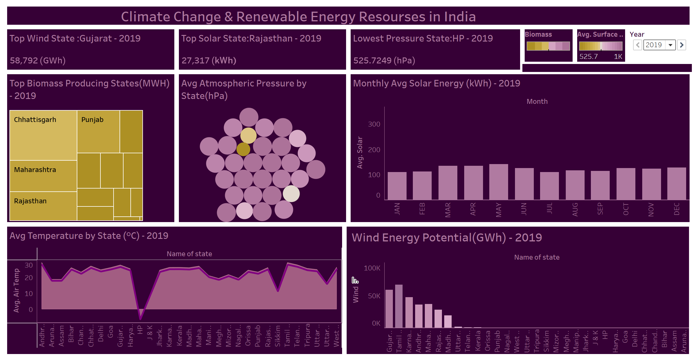
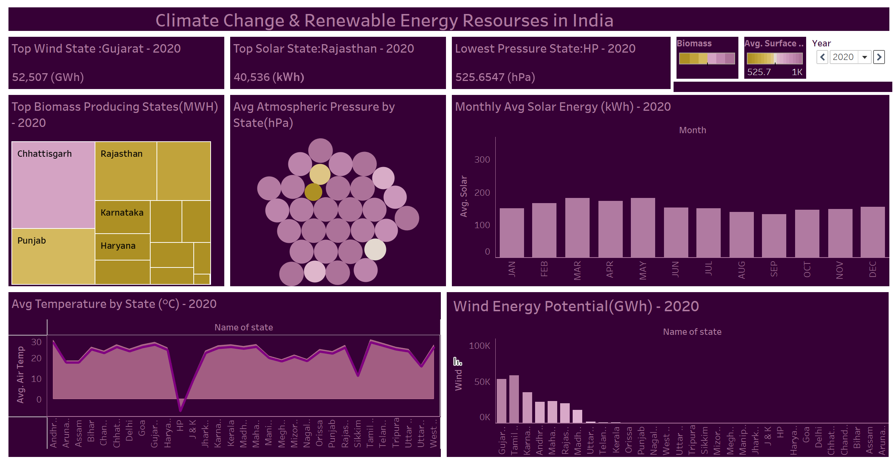
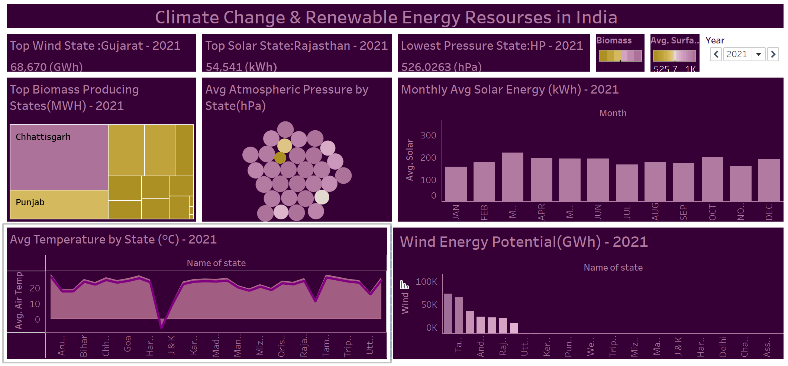
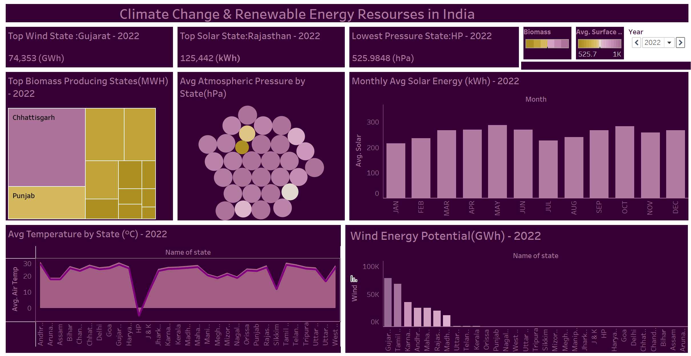
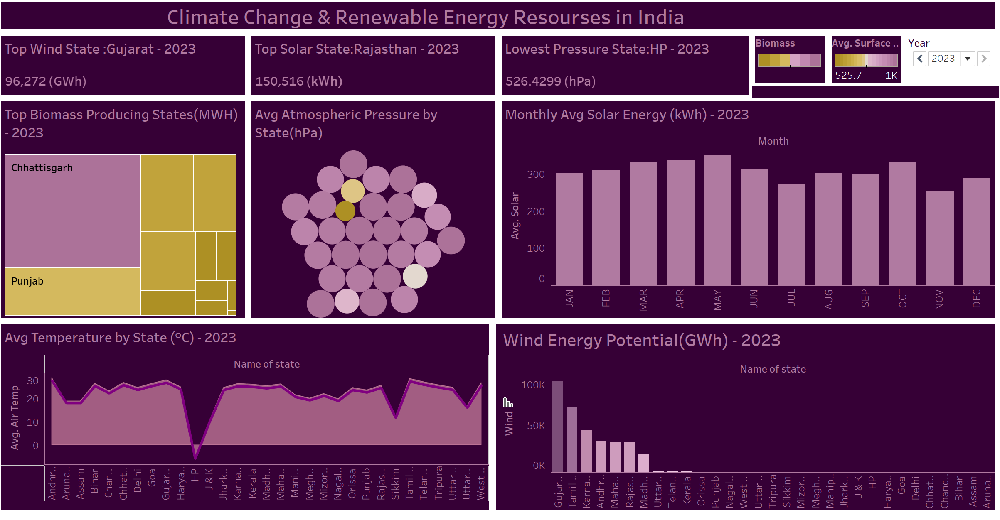

Climate Change & Renewable Energy Resources in India 🌞🌬️🌱

This project analyzes climate conditions and renewable energy generation across Indian states from **2019 to 2023** using data preprocessing in Python and interactive dashboards in Tableau.

---

 📊 Key Insights (2019–2023)
- **Gujarat** is consistently the top wind energy producer.
- **Rajasthan** leads in solar energy generation across all years.
- **Chhattisgarh** and **Punjab** are major contributors to biomass energy.
- **Himachal Pradesh (HP)** records the lowest atmospheric pressure throughout.
- Solar energy trends show monthly and yearly increases over time.

---

 🛠️ Tools & Technologies
- **Python (Jupyter Notebook)** – For merging & preparing datasets
- **Tableau** – For interactive dashboard visualizations
- **Excel** – As the original data format

---

## 🗂️ Repository Structure

```
Climate-Energy-India/
│
├── data/
│   └── combine.ipynb
│
├── visualizations/
│   ├── Screenshot_2019.png
│   ├── Screenshot_2020.png
│   ├── Screenshot_2021.png
│   ├── Screenshot_2022.png
│   └── Screenshot_2023.png
│
└── README.md
```

---

## 📈 Tableau Dashboards (With Descriptions)

### 🔹 2019 Dashboard



- **Top Wind State:** Gujarat (58,792 GWh)
- **Top Solar State:** Rajasthan (27,317 kWh)
- **Biomass Leaders:** Chhattisgarh, Punjab, Maharashtra
- **Pressure & Temperature:** HP shows lowest pressure, moderate average temperatures across states
- **Solar Pattern:** Peak in May; consistent low in Jan–Feb
- **Wind Energy Potential:** Gujarat and Tamil Nadu lead

---

### 🔹 2020 Dashboard



- **Top Wind State:** Gujarat (52,507 GWh)
- **Top Solar State:** Rajasthan (40,536 kWh)
- **Biomass Leaders:** Chhattisgarh, Rajasthan, Karnataka
- **Slight Increase** in Solar Energy Output & Temperature
- **Wind Potential:** High in Gujarat, Tamil Nadu, and Karnataka

---

### 🔹 2021 Dashboard



- **Top Wind State:** Gujarat (68,670 GWh)
- **Top Solar State:** Rajasthan (54,541 kWh)
- **Biomass Leaders:** Chhattisgarh, Punjab
- **Pressure Trend:** HP still lowest at 526.02 hPa
- **Solar Energy:** Consistent month-to-month rise; higher than 2020
- **Wind Potential:** Tamil Nadu and Andhra Pradesh close behind Gujarat

---

### 🔹 2022 Dashboard



- **Top Wind State:** Gujarat (74,353 GWh)
- **Top Solar State:** Rajasthan (125,442 kWh)
- **Biomass:** Chhattisgarh and Punjab again at the top
- **Significant Solar Energy Growth** from previous years
- **Temperature Rise:** Small but visible trend upward
- **Wind Potential:** Gujarat surges ahead again

---

### 🔹 2023 Dashboard



- **Top Wind State:** Gujarat (96,272 GWh)
- **Top Solar State:** Rajasthan (150,516 kWh)
- **Biomass:** Chhattisgarh and Punjab still dominant
- **Highest Solar Output** across all years
- **Temperature Consistency** but noticeable peak in summer months
- **Wind Potential:** Gujarat remains undisputed leader

---

## 🧠 Data Processing

The `combine.ipynb` notebook contains:
- Joining climate and renewable datasets across multiple Excel files
- Cleaning, formatting, and preparing for Tableau input
- Monthly and yearly summaries of energy production and climate parameters

---

## ✅ Project Highlights
- 📅 5-year comparative energy data
- 📈 Interactive and visual storytelling in Tableau
- ⚙️ Clean code, reusable notebook
- 💼 Ideal for portfolio or case study

---

## 🚀 How to Use

1. Clone or download this repository.
2. Open `combine.ipynb` in Jupyter Notebook to explore or update data.
3. Explore Tableau screenshots in the `visualizations/` folder.
4. Optionally, import updated datasets into Tableau to build your own dashboards.

---

## 📬 Contact

For suggestions, feedback, or collaboration feel free to open an issue or contact via GitHub.
